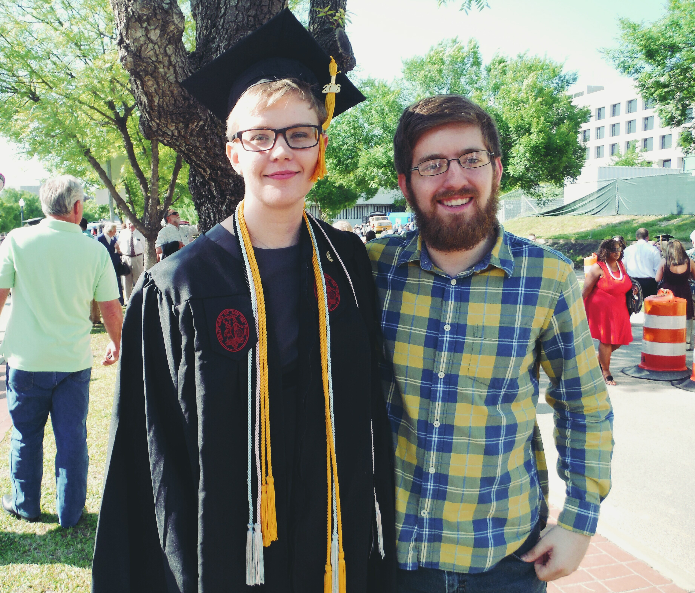

I graduated from the University of South Carolina Honors College in May 2016 with 
a B.S. in Computer Science and minors in Math and German. I'm currently 
getting my Master's while working as a research assistant in the 
<a href="https://afrl.cse.sc.edu">Autonomous 
Field Robotics Lab (AFRL)</a> and as an Introduction to Java TA (CSCE 145). 
My Master's thesis is on Unmanned Aerial and Unmanned Ground Vehicle cooperative exploration and mapping, and is a continuation of the Bird's eye View project.

I have previously interned at Boeing as a Software Engineer where I developed the Web SMT, which can be used to load software onto airplanes. I have also worked as a web developer for the Second Pillar consulting company.
